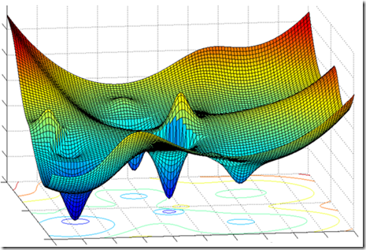

# The Mechanics of Optimization: Fine-Tuning Neural Networks

  

When building complex architectures—whether routing fluids in a magnetohydrodynamic system, managing load-following in nuclear reactor control, or developing production-grade machine learning models—having a fast, reliable engine is critical. In deep learning, that engine is your optimization algorithm.

Training a neural network is essentially navigating a high-dimensional landscape to find the lowest point of error (the global optimum). However, getting there efficiently requires more than just standard gradient descent. It requires strategic scaling, batching, and momentum.

Here is a breakdown of the core optimization techniques that make modern AI scalable and efficient.

## 1. Feature Scaling & Batch Normalization
The Mechanics: Before feeding data into a network, it must be standardized. Feature Scaling normalizes the input data (usually to a mean of 0 and a variance of 1) so that all features contribute equally. Batch Normalization takes this a step further by normalizing the activations inside the hidden layers of the network during training, adjusting them using learnable parameters ($\gamma$ and $\beta$).

* Pros: 
    *  Prevents the network from becoming hypersensitive to certain weights.
    * 	Significantly speeds up convergence.
    * 	Adds a slight regularization effect, reducing the need for dropout.
* Cons: Increases training time per epoch due to the extra computations.
    * 	Performs poorly if batch sizes are extremely small.

## 2. Mini-Batch Gradient Descent
The Mechanics: Instead of processing the entire dataset at once (Batch Gradient Descent) or processing it one example at a time (Stochastic Gradient Descent), Mini-Batch Gradient Descent strikes a compromise. The dataset is divided into smaller, manageable chunks (e.g., 32, 64, or 256 samples). The network updates its weights after evaluating each mini-batch.

Analogy: Think of it like importing foreign retail shipments. You wouldn't process every package individually, nor would you wait for a year's worth of cargo to arrive at a transit hub before declaring them. You process them in batches for optimal logistical throughput.

* Pros:
    *	Much faster than processing the whole dataset.
    *	Leverages highly optimized matrix operations via GPUs.
    *	Introduces a small amount of noise, which can help the model escape saddle points.
* Cons:
    *	Requires tuning an additional hyperparameter: the batch size.

## 3. Gradient Descent with Momentum

The Mechanics: Standard gradient descent can oscillate erratically in ravines (areas where the surface curves much more steeply in one dimension than in another). Momentum solves this by calculating an exponentially weighted average of past gradients and using it to update the weights.

Like overcoming the physical inertia of a heavy machine part, momentum allows the algorithm to build up speed in directions where the gradient is consistently pointing, while dampening oscillations in directions where gradients rapidly change sign.

* Pros:
    *	Speeds up convergence significantly in complex landscapes.
    *	Smooths out the noisy updates introduced by mini-batch gradient descent.
* Cons:
    *	Introduces another hyperparameter ($\beta$) that must be tuned (though 0.9 is a highly reliable default).

## 4. RMSProp Optimization

The Mechanics: Root Mean Square Propagation (RMSProp) also relies on the history of gradients, but instead of tracking the average direction (like momentum), it tracks the exponentially weighted average of the squares of the gradients. It then divides the current gradient by the square root of this average.

This effectively scales the learning rate for each parameter individually: parameters with large, oscillating gradients get a reduced learning rate, while parameters with small gradients get a boost.

* Pros:
    *	Excellent at navigating highly skewed or elliptical topographies.
    *	Prevents the learning rate from vanishing too quickly.
* Cons:
    *	Still requires manual selection of a global learning rate.

## 5. Adam Optimization

The Mechanics: Adaptive Moment Estimation (Adam) is the industry standard for most modern neural networks. It is essentially a combination of Momentum and RMSProp. It calculates both the exponentially weighted average of past gradients (the first moment) and the exponentially weighted average of past squared gradients (the second moment), applying bias corrections to both.

* Pros:
    *	Highly robust and performs exceptionally well across a wide variety of tasks (from basic computer vision to advanced Transformer architectures).
    *	Requires very little hyperparameter tuning; the default values ($\beta_1 = 0.9$, $\beta_2 = 0.999$, $\epsilon = 1e-8$) almost always work.
* Cons:
    *	Can sometimes fail to converge to the absolute global minimum as effectively as standard SGD with momentum on certain image classification tasks.

## 6. Learning Rate Decay

The Mechanics: If your learning rate is too high, your model will ping-pong around the minimum and never settle. If it’s too low, training will take an eternity. Learning Rate Decay (or annealing) solves this by starting with a large learning rate to traverse the landscape quickly, and progressively shrinking the learning rate as training continues, allowing for a precise "landing" at the optimum.

* Pros:
    *	Enables both fast initial learning and fine-grained convergence.
    *	Can be implemented in various schedules (step decay, exponential decay, inverse time decay).
* Cons:
    *	Adds complexity to the training loop.

Optimization is about control, efficiency, and scalability. By combining Adam, mini-batches, batch normalization, and learning rate decay, you transform a fragile mathematical model into a robust, high-performance machine.